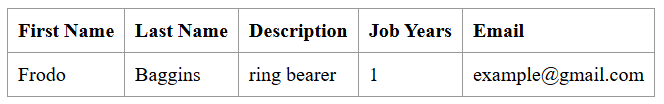
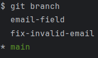
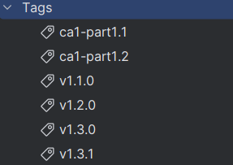
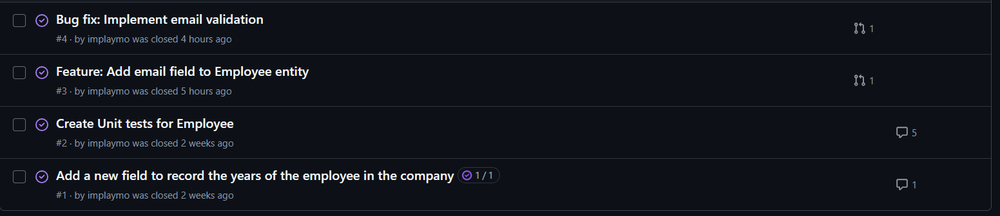

# CA1, Part 1: Technical Report - Version Control with Git

## Introduction
This guide provides step-by-step instructions on using Git for version control while developing a React.js and Spring Data REST application. The assignment is divided into two stages:
- **First Week**: Development without branches (all changes in `main`).
- **Second Week**: Development using branches for features and fixes.

By following these steps, you will learn how to manage a repository effectively, implement features, and handle bug fixes using Git and GitHub.

---

## Part 1: First Week (No Branches)
### Copy the Application
To begin, copy the [Tutorial React.js and Spring Data REST application](https://github.com/spring-attic/tut-react-and-spring-data-rest/tree/master/basic) pom.xml file and basic folder into a new folder named CA1/part1. Use the following command:
```sh
cp -r path/to/tutorial-app CA1/part1
```

### Initialize Git and Push the Code
Navigate to your project directory, initialize Git, and push the initial version to the `main` branch:
```sh
git init
git add .
git commit -m "Initial commit of tutorial application"
git push origin main
```

### Tag the Initial Version
To mark the initial version of your application, create and push a Git tag:
```sh
git tag v1.1.0
git push origin v1.1.0
```

### Add a New Feature (jobYears Field)

#### Step 1: Modify the Employee Entity to Include a New Field, `jobYears`

##### - Employee.java:
The Java class, which models an employee, has been updated to include a new integer field called jobYears. This update involved adding the field along with its corresponding getter and setter methods to enable data encapsulation, access control, and parameter validation. Below are the key changes made to the Employee class to implement this new functionality and ensure comprehensive data validation.

1. Open the `Employee.java` file located in `CA1/part1/basic/src/main/java/com/greglturnquist/payroll/`.
2. Add a new field `jobYears` of type `int` to the `Employee` class.
3. Update the constructor to include the new field.
4. Add getter and setter methods for the `jobYears` field.
5. Add validation to ensure only integer values are accepted.

```java
// Add the new field
private int jobYears;

// Update the constructor
public Employee(String firstName, String lastName, String description, int jobYears, String email) {
    if(!isFirstNameValid(firstName)) {
        throw new IllegalArgumentException("First name can't be null or empty.");
    }
    if(!isLastNameValid(lastName)) {
        throw new IllegalArgumentException("Last name can't be null or empty.");
    }
    if(!isDescriptionValid(description)) {
        throw new IllegalArgumentException("Description can't be null or empty.");
    }
    if(!isJobYearsValid(jobYears)) {
        throw new IllegalArgumentException("Job years can't be negative.");
    }
    if(!isEmailValid(email)) {
        throw new IllegalArgumentException("Email can't be null or empty.");
    }
    this.firstName = firstName;
    this.lastName = lastName;
    this.description = description;
    this.jobYears = jobYears;
    this.email = email;
}

// Add getter and setter methods
public int getJobYears() {
    return jobYears;
}

public void setJobYears(int jobYears) {
    if(!isJobYearsValid(jobYears)) {
        throw new IllegalArgumentException("Job years can't be negative.");
    }
    this.jobYears = jobYears;
}

// Add validation method
private boolean isJobYearsValid(int jobYears) {
    return jobYears >= 0;
}
```

#### Step 2: Implement Unit Tests to Validate the New Field
#### - EmployeeTest.java:
- The EmployeeTest class contains unit tests for the Employee class to ensure its methods and validation logic work correctly, with a focus on the jobYears field. Here is a summary of the tests included:
    - Constructor and Field Tests: These tests check that the Employee object is correctly created with valid fields and that invalid fields (e.g., null or empty names) throw IllegalArgumentException.
    - Job Years Validation Tests: These tests ensure that the jobYears field is validated correctly, ensuring non-negative values. They include:
        - Tests to verify that valid jobYears values are accepted.
        - Tests to ensure that negative jobYears values throw IllegalArgumentException.

  The tests ensure the robustness of the Employee class by validating its behavior under various conditions.

1. Open or create the test file for the Employee class, typically located in src/test/java/com/greglturnquist/payroll/.
2. Write unit tests to validate the jobYears field.

- **Example of tests:**
```sh
class EmployeeTest {
@Test
    void shouldCreateEmployeeWithDefaultConstructor() {
        // arrange
        // act
        Employee employee = new Employee();
        // assert
        assertNotNull(employee);
    }

    @Test
    void shouldReturnValidObjectEmployeeWithAllFields() {
        // arrange
        // act
        Employee employee = new Employee("Antonio", "Silva", "Student", 1, "example@gmail.com");
        // assert
        assertNotNull(employee);
        assertEquals("Antonio", employee.getFirstName());
        assertEquals("Silva", employee.getLastName());
        assertEquals("Student", employee.getDescription());
        assertEquals(1, employee.getJobYears());
    }

    @Test
    void shouldReturnNullEmployeeIfNameNull() {
        // arrange
        // act
        // assert
        assertThrows(IllegalArgumentException.class, () -> new Employee(null, "Silva", "Student", 1, "example@gmail.com"));
    }

    @Test
    void shouldThrowIllegalArgumentExceptionIfNameEmpty() {
        // arrange
        // act
        assertThrows(IllegalArgumentException.class,
                () -> new Employee("", "Silva", "Student", 1, "example@gmail.com"));
    }
}
```
#### Step 3: Update the DatabaseLoader

#### - DatabaseLoader.java:
- The DatabaseLoader class is a Spring component that implements the CommandLineRunner interface. It is used to initialize the database with predefined data when the application starts. Specifically, it saves an Employee object to the EmployeeRepository during the application startup. This class ensures that the database has initial data for testing or demonstration purposes.

1. Open the DatabaseLoader.java file located in CA1/part1/basic/src/main/java/com/greglturnquist/payroll/.
2. Update the run method to include the jobYears field when creating a new Employee.

```sh
@Override
public void run(String... strings) throws Exception {
    this.repository.save(new Employee("Frodo", "Baggins", "ring bearer", 1));
}
```
#### Step 4: Update React Components(Update the EmployeeList and Employee Components in app.js)

#### - App.js: 
- The app.js file is a React application that fetches and displays a list of employees from a REST API. It consists of three main components:  
  - App: The root component that manages the state of the employee list. It fetches employee data from the API when the component mounts and stores it in the state.
  - EmployeeList: A component that receives the list of employees as a prop and renders a table with employee details.
  - Employee: A component that renders a single employee's details in a table row.
  - The application uses the client module to make HTTP requests to the API.

1. Open the app.js file located in CA1/part1/basic/src/main/js/.
2. Update the EmployeeList component to include the jobYears field in the table header and rows.
```sh
class EmployeeList extends React.Component {
    render() {
        const employees = this.props.employees.map(employee =>
            <Employee key={employee._links.self.href} employee={employee}/>
        );
        return (
            <table>
                <tbody>
                    <tr>
                        <th>First Name</th>
                        <th>Last Name</th>
                        <th>Description</th>
                        <th>Job Years</th>
                    </tr>
                    {employees}
                </tbody>
            </table>
        )
    }
}
```
3. Update the Employee component to display the jobYears field.
```sh
class Employee extends React.Component {
    render() {
        return (
            <tr>
                <td>{this.props.employee.firstName}</td>
                <td>{this.props.employee.lastName}</td>
                <td>{this.props.employee.description}</td>
                <td>{this.props.employee.jobYears}</td>
            </tr>
        )
    }
}
```
### Debug Server and Client
After confirming the integration of the jobYears field, I started the application using mvn spring-boot:run to evaluate its real-time functionality at http://localhost:8080/. This hands-on testing was essential to ensure the feature operated smoothly and remained compatible with existing components. At the same time, I performed an in-depth code review to validate data processing on the server side and confirm the correct display of jobYears on the client side, ensuring accuracy and upholding high code quality.

### Commit the Changes and Tag the New Version:
```sh
git add .
git commit -m "Added jobYears field with validation and tests"
git push origin main
git tag v1.2.0
git push origin v1.2.0
```

### Finalize Part 1.1
To mark the completion of Part 1.1, create a final tag:
```sh
git tag ca1-part1.1
git push origin ca1-part1.1
```

---

## Part 1: Second Week (Using Branches)

## - First Branch(email-field)
### Create a Feature Branch for Adding an Email Field
Ensure that the `main` branch is used only for stable versions.

### Create a Feature Branch for Adding an Email Field
**Create a new branch** on GitHub named `email-field`.

### Implement Email Field Feature
1. **Modify** the Employee Entity to Include an Email Field
```sh
// Add the new field
private String email;

// Update the constructor
public Employee(String firstName, String lastName, String description, int jobYears, String email) {
    if(!isFirstNameValid(firstName)) {
        throw new IllegalArgumentException("First name can't be null or empty.");
    }
    if(!isLastNameValid(lastName)) {
        throw new IllegalArgumentException("Last name can't be null or empty.");
    }
    if(!isDescriptionValid(description)) {
        throw new IllegalArgumentException("Description can't be null or empty.");
    }
    if(!isJobYearsValid(jobYears)) {
        throw new IllegalArgumentException("Job years can't be negative.");
    }
    if(!isEmailValid(email)) {
        throw new IllegalArgumentException("Email can't be null or empty.");
    }
    this.firstName = firstName;
    this.lastName = lastName;
    this.description = description;
    this.jobYears = jobYears;
    this.email = email;
}

// Add getter and setter methods
public String getEmail() {
    return email;
}

public void setEmail(String email) {
    if(!isEmailValid(email)) {
        throw new IllegalArgumentException("Email can't be null or empty.");
    }
    this.email = email;
}

// Add validation method
private boolean isEmailValid(String email) {
    return email != null && !email.trim().isEmpty();
}
```

2. **Implement** Unit Tests for Email Field
```sh
@Test
void shouldReturnEmailField() {
    // arrange
    Employee employee1 = new Employee("Antonio", "Silva", "Student", 1, "example@gmail.com");
    // act
    String email = employee1.getEmail();
    // assert
    assertEquals("example@gmail.com", email);
}

@Test
void shouldThrowIllegalArgumentExceptionWhenSettingEmailNull() {
    // arrange
    Employee employee1 = new Employee("Antonio", "Silva", "Student", 1, "example@gmail.com");
    // act & assert
    assertThrows(IllegalArgumentException.class, () -> employee1.setEmail(null));
}

@Test
void shouldThrowIllegalArgumentExceptionWhenSettingEmailEmpty() {
    // arrange
    Employee employee1 = new Employee("Antonio", "Silva", "Student", 1, "example@gmail.com");
    // act & assert
    assertThrows(IllegalArgumentException.class, () -> employee1.setEmail(""));
}

@Test
void shouldThrowIllegalArgumentExceptionWhenSettingEmailEmptyWithWhiteSpace() {
    // arrange
    Employee employee1 = new Employee("Antonio", "Silva", "Student", 1, "example@gmail.com");
    // act & assert
    assertThrows(IllegalArgumentException.class, () -> employee1.setEmail(" "));
}
```

3. **Update** DatabaseLoader.java
```sh
@Override
public void run(String... strings) throws Exception {
    this.repository.save(new Employee("Frodo", "Baggins", "ring bearer", 1, "example@gmail.com"));
}
```

4. **Update** React Components
```sh
class EmployeeList extends React.Component{
    render() {
        const employees = this.props.employees.map(employee =>
            <Employee key={employee._links.self.href} employee={employee}/>
        );
        return (
            <table>
                <tbody>
                    <tr>
                        <th>First Name</th>
                        <th>Last Name</th>
                        <th>Description</th>
                        <th>Job Years</th>
                        <th>Email</th>
                    </tr>
                    {employees}
                </tbody>
            </table>
        )
    }
}

class Employee extends React.Component{
    render() {
        return (
            <tr>
                <td>{this.props.employee.firstName}</td>
                <td>{this.props.employee.lastName}</td>
                <td>{this.props.employee.description}</td>
                <td>{this.props.employee.jobYears}</td>
                <td>{this.props.employee.email}</td>
            </tr>
        )
    }
}
```
### Commit the Changes and Tag the New Version:
**Push changes** to the branch:
```sh
git add .
git commit -m "Added email field with validation and tests"
git push origin email-field
```

### Finalize Version 1.3.0
4. **Open a Pull Request** on GitHub and merge the branch into `main`.
5. **Tag the new version** after merging:
```sh
git tag v1.3.0
git push origin v1.3.0
```

## - Second Branch(fix-invalid-email)
### **Create a new branch** on GitHub named `fix-invalid-email`.
### **Implement validation** to ensure that employee emails contain the `@` sign.
```sh
private boolean isEmailValid(String email) {
		if (email == null || email.trim().isEmpty()) {
			return false;
		}
		String emailRegex = "^[a-zA-Z0-9._-]+@[a-zA-Z0-9.-]+\\.[a-zA-Z]{2,}$";
		return email.matches(emailRegex);
	}
```
### **Implement tests** to ensure that employee emails contain the `@` sign.
- **Example of tests:**
```sh
@Test
    void shouldThrowIllegalArgumentWhenEmailWithoutAtSign() {
        assertThrows(IllegalArgumentException.class,
                () -> new Employee("Antonio", "Silva", "Student", 1, "example.com"));
    }

    @Test
    void shouldThrowIllegalArgumentWhenEmailWithAtSignInBeginning() {
        assertThrows(IllegalArgumentException.class,
                () -> new Employee("Antonio", "Silva", "Student", 1, "@example.com"));
    }

    @Test
    void shouldThrowIllegalArgumentWhenEmailWithAtSignAtEnd() {
        assertThrows(IllegalArgumentException.class,
                () -> new Employee("Antonio", "Silva", "Student", 1, "example.com@"));
    }
```

### Commit the Changes and Tag the New Version 1.3.1:
3. **Push changes** to the branch:
```sh
git add .
git commit -m "Added validation for email format"
git push origin fix-invalid-email
```
4. **Open a Pull Request** on GitHub and merge the branch into `main`.
5. **Tag the updated version**:
```sh
git tag v1.3.1
git push origin v1.3.1
```

### Finalize Version 1.2
To mark the completion of Part 1.2, create a final tag:
```sh
git tag ca1-part1.2
git push origin ca1-part1.2
```

---
## Final Results 

### Implementation

After completing this project, my employee model now includes several key fields to store essential employee information. The fields "First Name," "Last Name," and "Description" were already part of the model and remain unchanged.

As part of the enhancements, I added the "Job Years" field in first week of CA1, allowing the system to track the length of an employee's tenure. In second week of CA1, I further improved the model by introducing the "Email" field, enabling the storage of contact details.

With these modifications, my employee model is now more comprehensive, making it easier to manage employee records efficiently.

The final state of the application is illustrated below:



### Branches
This assignment taught me the value of using branches to isolate changes for specific features or fixes. This approach helps maintain a stable main codebase while also providing a clear and well-organized record of changes.


### Tags
Using tags taught me how to highlight key milestones in the project's history. This is essential for monitoring the project's progress over time and allows for quick restoration of previous versions when needed.


### Issues
During the development process, four issues were created on GitHub to track and resolve problems. These issues were tracked by including "#1," "#2," "#3," and "#4" in the commit messages.
Issues serve various purposes, such as tracking bugs, feature requests, or tasks. They can be assigned to team members, labeled for easy searching, and linked to commits or pull requests. Going forward, the aim is to use issues throughout the development process to manage tasks, track progress, and facilitate collaboration, particularly in team settings.
This section highlights the evolution of the application, demonstrating the addition of new features, the use of branching for development, and marking milestones with tags. The visual representations of branches and tags showcase version control concepts while emphasizing the collaborative nature of software development. The use of issue tracking underscores the importance of maintaining an organized project history, ensuring all changes are well-documented and traceable.



## Alternative Solution

# **Comparison of Mercurial and Git**

## **Feature Comparison**

| **Feature**            | **Mercurial (Hg)**                                           | **Git**  |
|------------------------|--------------------------------------------------------------|----------|
| **Architecture**       | Distributed version control, similar to Git, where every developer has a full repository copy. | Distributed architecture, enabling multiple full-version repositories for enhanced redundancy and collaboration. |
| **Versioning Model**   | Snapshot-based, storing the entire project state at each commit, ensuring complete tracking. | Adopts a snapshot-based approach, encapsulating the state of the entire repository at each commit for comprehensive tracking. |
| **Branching and Merging** | Uses named branches and bookmarks; merging is simple and built-in, though less flexible than Git. | Provides efficient branching and merging capabilities, ideal for parallel development workflows. |
| **Binary Files Handling** | Handles binary files more efficiently with fewer issues related to large files, thanks to built-in optimizations. | Stores complete binary files per change, which may increase repository size but ensures ease of access to all versions. |
| **Performance**       | Optimized for speed with a focus on simplicity; performs well on large repositories. | Highly optimized for speed, especially in operations like branching, merging, and rebasing. |
| **Ease of Use**       | Simpler command set and a more user-friendly interface compared to Git. | Powerful but has a steeper learning curve due to its complex command structure. |
| **Platform Support**  | Cross-platform support with better Windows compatibility out of the box. | Cross-platform support but may require extra setup on Windows for full functionality. |

---

## **Utilizing Mercurial for the Assignment**

Mercurial can be employed similarly to Git, offering a straightforward workflow with its own set of commands.

### **1. Initial Repository Setup and Import**

To begin, a Mercurial repository needs to be created and initialized to manage the **Tutorial React.js and Spring Data REST** application:

```sh
# Create a new Mercurial repository
hg init /path/to/mercurial_repository  

# Add project files and commit the initial import
cd /path/to/TutorialReactSpringDataREST  
hg add  
hg commit -m "Initial import"
```

### **2. Feature Development and Branch Management**
Mercurial supports branching using named branches or bookmarks. Bookmarks function similarly to Git branches:

```sh
# Create a new feature branch
hg branch feature-branch  
hg commit -m "Creating feature branch"
```

### 3. Continuous Integration: Committing and Tagging
Changes are committed frequently, ensuring a clear history of the development process. Stable versions are tagged for easy tracking:
```sh
# Commit changes to the feature branch
hg commit -m "Implemented new feature"

# Tag a stable release
hg tag v1.0  
hg commit -m "Tagging version 1.0"
```

### 4. Merging Features and Preparing for Deployment
Once a feature is completed and tested, it is merged back into the main branch to prepare for deployment:

```sh
# Switch to the main branch
hg update default  

# Merge the feature branch into the main branch
hg merge feature-branch  
hg commit -m "Merged feature branch into main"
```

Mercurial offers a solid alternative to Git, particularly for developers who prefer a more straightforward interface and better Windows support. While Git remains the industry standard, Mercurial provides a compelling option for teams that value simplicity without sacrificing power.

## Conclusion

At the conclusion of the Version Control with Git assignment, I have developed a solid understanding of version control systems and their crucial role in software development. The first part of the assignment guided me through the basics, such as making direct modifications to the master branch, committing changes, and utilizing tags. Completing this section helped me become familiar with core version control workflows, which are essential for managing code in both individual and collaborative projects.
As I progressed to the second part, which introduced branching, I gained hands-on experience with more advanced version control techniques. This included managing separate branches for feature development or bug fixes, allowing me to isolate changes and maintain a clearer project history while streamlining the overall management process.
In the Final Results section, I showcased the practical application of version control principles. I demonstrated how my project evolved by adding new features incrementally and managing code changes efficiently. I also used GitHub issues to track and resolve problems within my project, highlighting the usefulness of this feature for managing bug tracking and ensuring clear problem-solving documentation.
Additionally, by exploring Mercurial as an alternative to Git, I gained a deeper understanding of version control systems. While Mercurial, like Git, is a distributed version control system, it differs by offering a more centralized approach, simplifying repository management and making it easier for teams looking for a more streamlined solution.
In conclusion, this assignment not only enhanced my technical skills with Git and Mercurial, but also highlighted the importance of version control in fostering collaboration, ensuring code integrity, and efficiently managing the evolution of software projects. I now have a greater appreciation for how version control plays a vital role in streamlining software development processes.