# CA1, Part 2: Technical Report – Build Tools with Gradle

## Introduction 

This guide focuses on practicing Gradle using a simple example application. Students will set up and modify a Gradle project, add custom tasks, and integrate unit testing. Key tasks include executing the provided application, adding Gradle tasks for running a server, performing backups, and creating a zip archive. Proper version control practices, including multiple commits, tagging and using issues, are required.

---

## Setting Up the Project

### Create the Directory and Clone the Repository
Begin by creating a new directory for the assignment at **/CA2/Part1**. Once the directory is set up, clone the example application from the provided Bitbucket repository. This repository includes a **build.gradle** file and the Gradle Wrapper, ensuring a consistent build environment.

### Verify Gradle Installation
After cloning the project, check that Gradle is installed and properly configured by running the following command in the terminal:

```sh
gradle -v
```
This step confirms that Gradle is ready to use before proceeding further.

### Import the Project into an IDE

Open an Integrated Development Environment (IDE) that supports Gradle and import the project. Using an IDE simplifies project management by providing built-in Gradle tools and automation features.

### Run a Basic Gradle Build

To validate the project setup, execute a basic Gradle build. This ensures that all dependencies are correctly configured and that the project is ready for development. Run the following command:

```sh
gradle build
```

### Proceed with Further Development
With the setup complete, the project is now ready for further modifications and tasks as outlined in the assignment.

---

## Gradle Basic Demo 

The **Gradle Basic Demo** provides a hands-on exercise in working with a multi-threaded chat server capable of handling multiple client connections simultaneously.

### **1. Building the Project**
To prepare the demo for execution, navigate to the root directory of the project and run the following command:

```sh
./gradlew build
```
**The expected output** in the terminal should be:

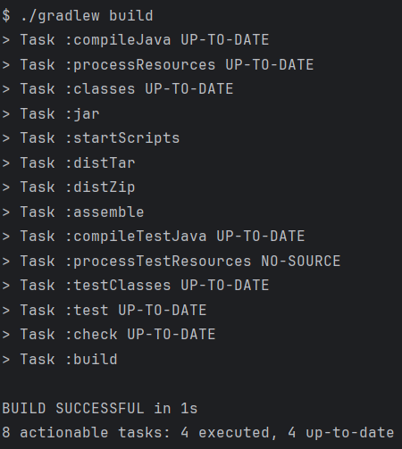

This command compiles the source code and packages it into an executable .jar file. A successful build ensures that all dependencies are correctly resolved and the project is ready to run.
### **2. Start the Server**
Once the build is complete, launch the chat server with the following command:
```sh
java -cp build/libs/basic_demo-0.1.0.jar basic_demo.ChatServerApp 59001
```
**The expected output** in the terminal should be:

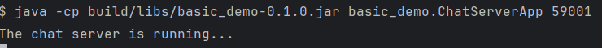

This starts the server and prepares it to accept incoming client connections.

### **3. Connecting Clients**
To connect clients to the server, run the following command in separate terminals:
```sh
./gradlew runClient
```
Each client will connect to localhost on port 59001. The build.gradle file is configured to allow easy modification of connection settings if needed.
To test the multi-client functionality, multiple client instances can be launched from different terminals. This demonstrates the server's ability to manage and handle multiple client connections simultaneously

**The output you should see is:**

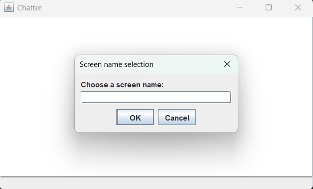

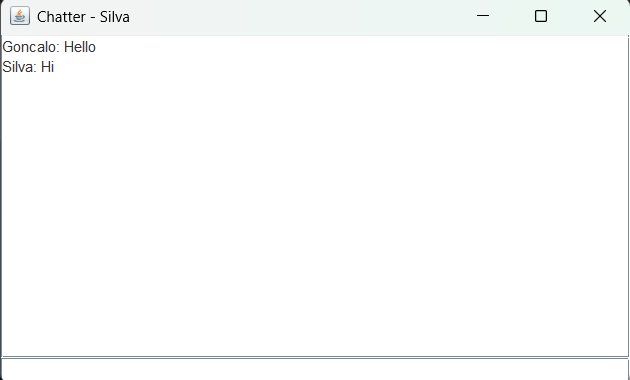

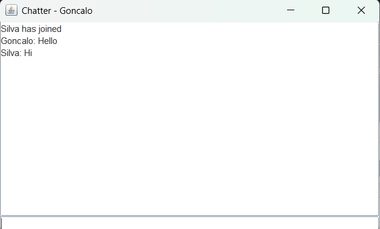


---

## Add a New Task to Execute the Server

In this section, you will learn how to create a runServer task in your build.gradle file to streamline the process of starting the chat server directly from Gradle. This approach eliminates the need for manual command line inputs each time the server needs to be started.

#### Step 1: Open the build.gradle File
Start by opening the build.gradle file in your project. This file contains the configuration for the Gradle build and is where the custom tasks will be defined.

#### Step 2: Add the runServer Task
To define the new runServer task, add the following code to the build.gradle file:

```sh
task runServer(type:JavaExec, dependsOn: classes) {
    group = "DevOps"
    description = "Launches the chat server on port 59001"

    classpath = sourceSets.main.runtimeClasspath

    mainClass = 'basic_demo.ChatServerApp'

    args '59001'
}
```

This Gradle task, runServer, is used to start the chat server:

- **type: JavaExec**: Defines the task as a Java application execution.
- **dependsOn: classes**: Ensures the code is compiled before running the task.
- **group = "DevOps"**: Categorizes the task under the "DevOps" group.
- **description** = "Launches the chat server on port 59001": Provides a description of what the task does.
- **classpath = sourceSets.main.runtimeClasspath**: Sets the classpath to include the compiled classes and dependencies.
- **mainClass = 'basic_demo.ChatServerApp'**: Specifies the main class to run, which starts the chat server.
- **args '59001'**: Passes the port number 59001 as an argument to the server for client connections.

This task makes it easier to run the chat server directly from Gradle.

To test the functionality of this addition, execute the following command in terminal:

```sh
./gradlew runServer
```

**Expected result:**

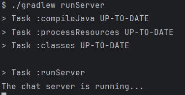

The immediate feedback from the terminal confirms the task's successful execution.

--- 
## Add a unit test

Now, let's add a unit test to verify the functionality of the App class. This test will check if the class returns a non-null greeting message, which is an important feature of the application.

### Add JUnit Dependency to build.gradle

To ensure that the test framework is set up properly, add the JUnit dependency to your build.gradle file. This is essential for running unit tests.

In the dependencies block of build.gradle, add the following line:

```sh
testImplementation 'junit:junit:4.12'
```

This ensures that the JUnit library is available when running the tests.

### Create a New Directory for Tests
Create a new directory in the src/test/java folder to organize the test files. The directory path will be:

### Create the Unit Test File

Inside this directory, create a new Java file called AppTest.java. This file will contain the unit test for the App class.

**Example test:**

```sh
package basic_demo;

import org.junit.Test;
import static org.junit.Assert.*;

public class AppTest {
    @Test public void testAppHasAGreeting() {
        App classUnderTest = new App();
        assertNotNull("app should have a greeting", classUnderTest.getGreeting());
    }
}
```

To execute the test, run the following command in terminal:

```sh
./gradlew test
```

**Expected output:**

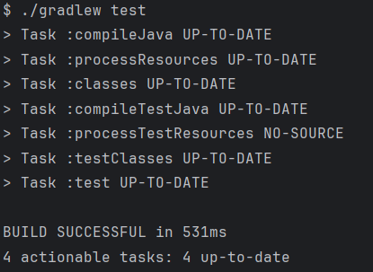

The result indicates the test passed successfully.

---

## Add a new task of type Copy

The next step is to add a new task of type Copy to the build.gradle file. This task will create a backup of the source code, ensuring a reliable recovery point is available in case of any unexpected issues during development.

### Define the Backup Task with a Timestamp

In this implementation, a timestamp is added to the backup folder name to ensure each backup is uniquely identified. This approach makes it easier to keep track of different versions of the backup.

Here’s how to define the backup task in build.gradle:

```sh
task backupSrc(type: Copy) {
    description 'Creates a backup of the src directory to the backup folder'

    def timestamp = new Date().format('yyyyMMdd-HHmmss')

    from 'src'  // The source directory to copy from

    into "backup/src-backup-${timestamp}"  // The destination folder with timestamp

    doFirst {
        println "Creating backup of src directory to backup/src-backup-${timestamp}"
    }

    doLast {
        println "Backup completed successfully!"
    }
}
```

**Explanation of the Task Configuration**
- **description**: A brief description of what the task does. In this case, it describes creating a backup of the src directory into a backup folder.
- **timestamp**: A timestamp is generated using the current date and time in the format yyyyMMdd-HHmmss, which is appended to the backup folder name to make it unique.
- **from 'src'**: Specifies the src directory as the source of the files to be copied.
- **into "backup/src-backup-${timestamp}"**: Defines the destination folder for the backup. The timestamp ensures that each backup is placed in a uniquely named directory.
- **doFirst {}**: This block runs before the task executes and prints a message indicating that the backup process is starting.
- **doLast {}**: This block runs after the task completes and prints a message confirming that the backup was successfully completed.

### Test Backup task
Once the backup task has been implemented, it's important to verify that it works as expected. Follow these steps to test the task:

1. Run the Backup Task: In the terminal, execute the following Gradle command:

```sh
./gradlew backupSrc
```
**Expected output:**

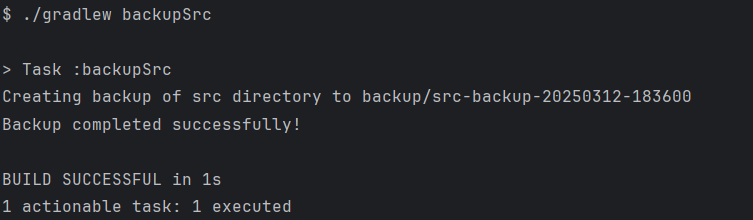


This output confirms that the task is working properly.

Although the backup folder is not present in the remote repository, it has been successfully created in the local development environment. After executing the backup task in Gradle, the backup folder should appear in the local file system, as shown in the screenshot below.

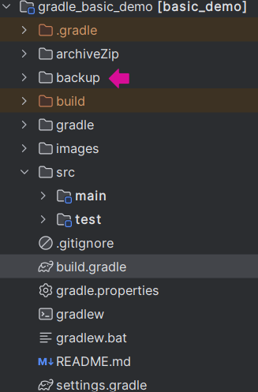

The person following this guide should expect the same result in their local environment.

By adding the backup task to the Gradle build script, the project’s resilience is improved, as it provides an easy and reliable way to back up the code. This addition ensures that you have a safety net in place, helping protect the project from potential issues during development.

---

## Add a new task of type Zip

The final task is to create a new task of type Zip to package the project's source code into a compressed .zip file. This Zip task simplifies the process of archiving the src directory into a .zip file, which is useful for backups or distributing the project.

This step is essential for archiving different iterations of the project or preparing the code for distribution. The task definition for creating the zip archive is as follows:

```sh
task archiveSrcIntoZip(type: Zip) {
    description 'Creates a backup of the src directory to zip file'
    def timestamp = new Date().format('yyyyMMdd-HHmmss')
    archiveFileName = "src-backup-${timestamp}.zip"
    destinationDirectory = file("archiveZip")  // This is the correct way to set the output directory

    from 'src'

    doFirst {
        destinationDirectory.get().asFile.mkdirs()  // Create directory if it doesn't exist
        println "Creating zip file of src directory to ${archiveFile.get()}"
    }

    doLast {
        println "Zip file successfully created!"
    }
}
```

**Explanation of the Task Configuration**
- **description:** A brief description of the task, indicating that it creates a backup of the src directory as a .zip file.
- **timestamp:** A timestamp is generated in the format yyyyMMdd-HHmmss to ensure each backup has a unique file name.
- **archiveFileName:** The name of the output zip file includes the timestamp, resulting in a file name like src-backup-20230315-153045.zip.
- **destinationDirectory:** The .zip file will be saved in the archiveZip folder. If the folder does not exist, it will be created.
- **from 'src':** Specifies the source directory that will be included in the zip file.
- **doFirst {}:** Ensures that the archiveZip directory is created before the task runs. It also prints a message indicating the zip file creation.
- **doLast {}:** Prints a success message after the task completes, confirming that the zip file was created.

The archiveSrcIntoZip task is configured to package the src directory into a timestamped .zip file, and it is placed into the archiveZip directory. 
This setup ensures that each backup file is uniquely named with the current date and time.

### Test the Zip Task

Once the archiveSrcIntoZip task has been defined, it’s important to test its functionality to ensure it works as expected. Follow these steps to execute and verify the task:

1. Run the following command in the terminal to execute the archiveSrcIntoZip task:

```sh
./gradlew archiveSrcIntoZip
```

**Expected output:**

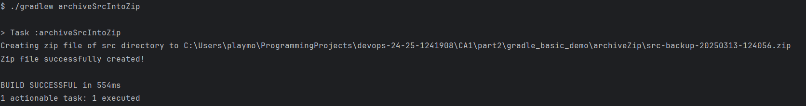

This output confirms that the task is working properly.

Although the archiveZip folder is not present in the remote repository, it has been successfully created in the local development environment. After executing the archiveSrcIntoZip task in Gradle, the archiveZip folder should appear in the local file system. Inside this folder, the .zip archive of the src directory will be available, as shown in the screenshot below.

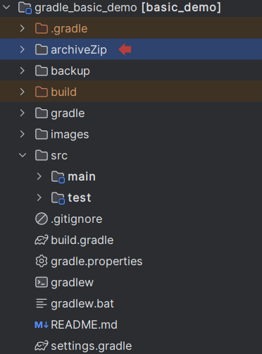

---

## Conclusion 

This project provided valuable insights into the use of Gradle as a build tool. Key tasks, including runServer, backupSrc, and archiveSrcIntoZip, demonstrated how Gradle can automate essential development processes, such as server execution, file backups, and archiving. Additionally, integrating a unit test highlighted the importance of automated testing within the build process.

The use of GitHub issues played a crucial role in tracking progress, with tasks being linked to specific issues and closed using the Closes #<issueNumber> syntax in commits. This approach ensured efficient task management and clear documentation of the work completed.

Overall, the project enhanced the understanding of Gradle’s capabilities in streamlining development workflows, making tasks more efficient, and ensuring the resilience of the project. The skills gained will be valuable for future projects, contributing to more reliable and maintainable development processes.