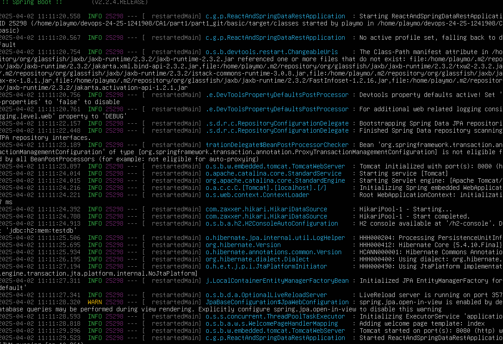

CA2 Part1: Virtualization: Technical Report 

# Introduction

This guide provides detailed instructions on using virtualization techniques with VirtualBox. It covers the process of setting up and configuring a virtual machine, establishing the development environment, and running various projects within the virtualized setup.

By following these steps, you will gain hands-on experience in creating and managing virtual environments, which are essential for modern software development and operations.


## VirtualBox Virtual Machine Setup Guide

### Step 1: Download and Install VirtualBox

The first step is to download VirtualBox from the official website [here](https://www.virtualbox.org/wiki/Downloads) and install it on your system.

### Step 2: Create a New Virtual Machine

Once VirtualBox is installed, you must launch VirtualBox and click on the "New" button to begin setting up a new virtual machine (VM). You must:

- Name the VM.
- Select the appropriate type and version that matches the operating system you intend to install.

### Step 3: Allocate Memory and Create a Virtual Hard Disk

You must allocate enough memory to the virtual machine to ensure smooth operation. After memory allocation, you must create a virtual hard disk to meet the VM’s storage requirements.

### Step 4: Mount the Operating System ISO File

In the VM settings, under the "Storage" section, you must mount the ISO file of the operating system to the virtual CD/DVD drive. This allows the virtual machine to access the installation media for the OS.

### Step 5: Start the VM and Install the OS

After mounting the ISO file, you must start the VM. You will then follow the on-screen instructions to install the operating system.

### Step 6: Install VirtualBox Guest Additions

Once the OS installation is complete, you must install the VirtualBox Guest Additions to improve the integration between the host machine and the virtual machine.

### Step 7: Configure the Virtual Machine for Ubuntu 18.04 Minimal Installation

You must configure the virtual machine settings in preparation for the Ubuntu 18.04 minimal installation. Follow these steps:

1. Connect the VM to the Ubuntu installation media available via the provided minimal CD link.
2. Allocate 2048 MB of RAM to ensure adequate performance.
3. For networking, set Network Adapter 1 to **NAT** to allow internet access.
4. Configure Network Adapter 2 as a **Host-only Adapter (vboxnet0)** to enable isolated communication between the VM and the host machine.

By following these steps, you will successfully configure a virtual machine in VirtualBox with the desired operating system and network settings.

---

## Configuring Network and Essential Services for Virtual Machine

### Step 1: Open VirtualBox Host Network Manager

Once the basic virtual machine setup is completed, you must focus on configuring the network and essential services to enhance the functionality and accessibility of the VM. To begin, you must open the **VirtualBox Host Network Manager** by navigating to the main menu and selecting **File -> Host Network Manager**.

### Step 2: Create a Host-Only Network

You must click the **Create** button, which will add a new Host-only network to the list. This setup will allow you to specify a name for the network within the virtual machine’s network settings.

### Step 3: Configure the Host-Only Adapter

After setting up the **Host-only Adapter**, you must check the IP address range. The default range is **192.168.131.1/24**. You should choose **192.168.131.5** as the IP address for the second adapter of the VM to ensure it falls within the designated subnet.

### Step 4: Update Package Repositories

Upon booting the virtual machine, you must update the package repositories to ensure all software is up to date. Run the following command:

```bash
sudo apt update
```

### Step 5: Install Network Tools
You must install the network tools package to facilitate network configuration. Run the following command to install it:
```bash
sudo apt install net-tools
```

### Step 6: Configure Network Settings
To assign the chosen IP address, you must edit the network configuration file. Use the following command to open it:
```bash
sudo nano /etc/netplan/01-netcfg.yaml
```
You must ensure the file contains the following network configuration settings:

```bash
network:
  version: 2
  renderer: networkd
  ethernets:
    enp0s3:
      dhcp4: yes
    enp0s8:
      addresses:
        - 192.168.131.5/24
```
After editing the configuration file, you must apply the changes with this command:

```bash
sudo netplan apply
```

### Step 7: Install and Configure OpenSSH Server
To remotely manage the VM, you must install and configure the OpenSSH server. First, install it by running:
```bash
sudo apt install openssh-server
```

Next, you must enable password authentication by editing the SSH configuration file. Open it with the following command:
```bash
sudo nano /etc/ssh/sshd_config
```

Uncomment the line PasswordAuthentication yes to enable password-based login. After saving the changes, you must restart the SSH service with the following command:
```bash
sudo service ssh restart
```

### Step 8: Set Up an FTP Server
To enable file transfer to and from the VM, you must set up an FTP server. First, install vsftpd by running:
```bash
sudo apt install vsftpd
```

Then, you must enable write access within the FTP server configuration. Open the configuration file:
```bash
sudo nano /etc/vsftpd.conf
```

Uncomment the line write_enable=YES to allow to write access. After saving the changes, restart the FTP service:
```bash
sudo service vsftpd restart
```

By following these steps, the virtual machine will be properly configured with networking, SSH, and FTP services, ensuring enhanced functionality and accessibility.

# Cloning a Repository Inside a Virtual Machine

To clone an individual repository inside a virtual machine, follow these steps to set up secure SSH access between the VM and a remote repository.

## Step 1: Access the Virtual Machine via SSH
Since the SSH server is enabled in the VM, use SSH to connect to the VM from the host machine (Windows, Linux, or macOS). In a terminal or console, type:

```sh
ssh <vm-username>@<vm-ip-address>
```

Where:
- `<vm-username>` should be replaced with the username of the VM.
- `<vm-ip-address>` should be replaced with the IP address of the VM.

## Step 2: Clone the Repository
Once inside the VM, clone the repository into the desired directory by running:

```sh
git clone <repository-url>
```

Replace `<repository-url>` with the actual URL of the repository you want to clone.

This will create a local copy of the repository inside the VM, allowing work to be done seamlessly.

## Setting Up the Development Environment

After setting up the virtual machine and ensuring it is properly configured for network access, follow these steps to install the necessary development tools.

### Step 1: Update and Upgrade Installed Packages
To ensure all software on the VM is up to date, run the following commands:

```sh
sudo apt update
sudo apt upgrade
```

### Step 2: Install Git
Git is required for version control and source code management. Install it by running:

```sh
sudo apt install git
```

### Step 3: Install Java Development Kit (JDK) and Java Runtime Environment (JRE)
For Java-based projects, install the required JDKs and JREs:

```sh
sudo apt install openjdk-17-jdk openjdk-17-jre
sudo apt install openjdk-21-jdk openjdk-21-jre
```

Having multiple JDK versions installed allows switching between them when working on projects that require different Java versions.

### Step 4: Install Maven
Maven is needed for managing dependencies and building Java projects. Install it using:

```sh
sudo apt install maven
```

### Step 5: Install Gradle
Gradle requires additional steps for installation:

```sh
wget https://services.gradle.org/distributions/gradle-8.6-bin.zip
sudo mkdir /opt/gradle
sudo unzip -d /opt/gradle gradle-8.6-bin.zip
```

To ensure Gradle can be executed from any location within the terminal, add its `bin` directory to the system PATH by modifying the `.bashrc` file:

```sh
echo "export GRADLE_HOME=/opt/gradle/gradle-8.6" >> ~/.bashrc
echo "export PATH=\$GRADLE_HOME/bin:\$PATH" >> ~/.bashrc
source ~/.bashrc
```

### Step 6: Verify Installations
To confirm that all tools have been installed correctly, check their versions using the following commands:

```sh
git --version
java --version
mvn --version
gradle --version
```

These installations equip the virtual machine with the necessary tools to build and manage Java applications effectively, allowing development and testing to proceed smoothly.


---

## Execute the Spring Boot react and basic tutorial project - CA1 - Part 1

After setting up the virtual machine and installing the required tools, follow these steps to execute a basic Spring Boot project.

## Step 1: Navigate to the Project Directory
Change to the directory where the Spring Boot project files are located:

```sh
cd /path/to/project-directory/basic
```
## Step 2: Make Maven Wrapper Executable
Before running any Maven commands, ensure the Maven wrapper is executable by running:

```sh
chmod +x ./mvnw
```

## Step 3: Prepare the Application
Before running the Spring Boot application, clean and install dependencies by executing the following command:

```sh
mvn clean install -N
```

if you get the error, "Some problems were encountered while processing the POMs: Non-resolvable parent POM for com.greglturnquist:react-and-spring-data-rest-basic"
add relativePath to subproject pom.xml


## Step 4: Run the Spring Boot Application
To start the Spring Boot application, execute the following command within the project directory:

```sh
mvn spring-boot:run
```

## Step 5: Determine the VM's IP Address
To ensure the application is accessible from external devices, such as the host machine or other devices on the same network, determine the VM’s IP address by running:

```sh
ifconfig
```

## Step 6: Access the Application
Use the VM’s IP address to access the application in a web browser. Replace `<vm-ip-address>` with the actual IP:

```sh
http://<vm-ip-address>:8080/
```

This should be your result:


If the application loads successfully and displays the expected content, this confirms that the backend is functioning correctly and the Spring Boot framework is properly serving the content.

---

## Execute Gradle Basic Demo Project - CA1 - Part 2

In this section, you will learn the process of building and running the `gradle_basic_demo` project, which involves executing it across two environments: the virtual machine and the host machine.
### Step 1: Navigate to the Project Directory in the Virtual Machine
First, navigate to the `gradle_basic_demo` directory within the virtual machine:

```sh
cd /path/to/gradle_basic_demo
```

### Step 2: Make Gradle Wrapper Executable
Before running any Gradle commands, ensure the Gradle wrapper is executable by running:

```sh
chmod +x ./gradlew
```

### Step 3: Build the Project in the Virtual Machine
To build the project, execute the following command within the project directory in the virtual machine:

```sh
./gradlew build
```

### Step 4: Run Tasks
Since the virtual machine setup is based on Ubuntu Server without a desktop environment, running GUI applications like the project’s chat client isn't possible on the VM, so you won't be able to execute the task runClient on the VM.
What you should do is the following:

1. In your VM run the following command:
```sh
./gradlew runServer
```

This command will start the server, allowing clients to communicate with each other.


2. You should open a terminal on the host machine, navigate to the gradle_basic_demo directory (ensure it is cloned on the host as well), and run the client component using the command below. This allows the client on the host machine to communicate with the server running on the VM by specifying the VM’s IP address and the port number:
```sh
./gradlew runClient --args="192.168.131.5 59001"
```

This way you will be able to establish several connections to the server running on your VM and see the GUI interface on your host machine.

You should have the following result:


Execute the other tasks with the following commands:

```sh
./gradlew backupSrc
./gradlew archiveSrcIntoZip
```

You should get the following results:


---

## Execute the Spring Boot react and basic tutorial project - CA1 - Part 3


### Step 1: Build the Project in the Virtual Machine

You should go to the basic folder within the gradle_basic_demo directory to begin the process. To build the application, execute the following command:

```sh
./gradlew build
```

### Step 2: Execute Spring Boot Application
After the build is complete, start the Spring Boot server using the command:

```sh
./gradlew bootRun
```

### Step 3: Verify 
With the server now running, you should go to a web browser and enter the following URL:

```
http://192.168.131.5:8080/
```

This is the result you should see in your VM:



## Conclusion

This technical report provides a comprehensive overview of the setup and execution of a virtual environment using VirtualBox for Class Assignment 3 Part 1. The assignment involved creating a virtual machine, configuring its network and services, and installing the necessary development tools for running various software projects.

The process of virtualization offered valuable insights into the management and configuration of virtual machines within a DevOps context. Successfully running the Spring Boot tutorial and the gradle_basic_demo projects within this virtual environment demonstrated the effectiveness of simulating real-world deployment and operational scenarios.

One of the main takeaways from this assignment is a deeper understanding of network configuration within virtualized environments and the intricacies of setting up software on virtual platforms. Throughout the process, several challenges arose, including configuring network interfaces and ensuring smooth communication between the host and guest machines. However, by successfully addressing these issues, I was able to gain a more thorough understanding of virtualization technologies.


